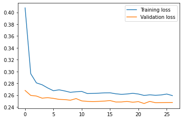
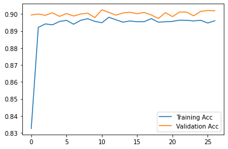

<h1> Customer-Segmentation-Predictions </h1>


# How to install and Run the Project
- ## PC/Laptop
     <p align="justify"> If using PC or Laptop, you may download Customer_segmentation.py, and Customer_segmentation_module.py file from depository section.</p>

     - Software Required
       - Sypder
       - Python (preferable the latest version)

     - Module Needed
       - Tensorflow
       - Sklearn
       - Pandas
       - Numpy

- ## Google Colab
     <p align="justify"> Click on this provided link, you will be redirected to Google Colab, </p> 
     https://colab.research.google.com/drive/1fiaUmVMJhwOM4pwFQ_5Cwc63_JyuYN7O?usp=sharing, <p align="justify"> you may sign in to your Google account to access it. 
     You may need to download 'models' folder from the depository section and reupload it in the Google colab left panel before you can run it.</p>

# Project Descriptions
  <p align="justify"> This project is to create a model that able to make a prediction about customer will subscribe to the Term Deposit after the campaign using deep learning approach.</p>
 
  ## Project Organization
  ```
  ├── Datasets                                    : Contains dataset used 
  ├── Models                                      : Contains all save model (format .pkl & .h5)
  ├── Statics                                     : Contains all save image (graph/heatmap/tensorboard)
  ├── __pycache__                                 : Contains .pyc file
  ├── Customer_segmentation.py                    : Code file in python format
  ├── Customer_segmentation_module.py             : Module file in python format
  ├── README.md                                   : Project Descriptions 
  └── model.png                                   : Model image
  ```

   ## Deep Learning Model
   - <p align="justify"> This are the model use to predict the customer will subscribe to the Term Deposit after the campaign or not.</p>
      
       

   ### Results
   - <p align="justify"> This model are able to predict the customer will subscribe to the Term Deposit after the campaign or not up to  <b>0.90 of accuracy</b>. The  following are graphs of my training and validation.</p>

     - <p align="justify"> Loss </p>

         
  
     - <p align="justify"> Accuracy </p>

        
  
     - <p align="justify"> Classification Report </p>

        
  

# Credit
This dataset is provided by 
[HackerEarth HackLive: Customer Segmentation](https://www.kaggle.com/datasets/kunalgupta2616/hackerearth-customer-segmentation-hackathon)
 
